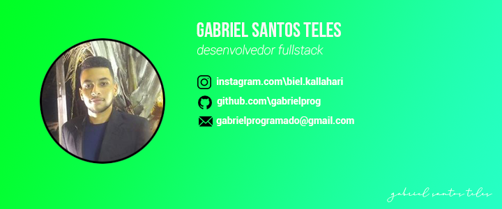

<h1 align="center">
    
</h1>

# API FEITA EM NODE JS
Está api foi desenvolvida como forma de demostrar meus conhecimentos em api
ela é um projeto base de um done list
---
***Recursos da api***
0. Criar um projeto
0. Lista todos os projetos criado
0. Adiciona tarefas ao projeto
0. Deleta o projeto
0. Informa a quantidade de requisição feita
0. Alterar Projetos já feito
---
## Modo de usar api 

***USANDO PORTA 3000, EXEMPLO:  http://localhost:3000/project***

### CRIA PROJETO
```
POST /project

{
	"id": "SEU_ID_EM_STRING",
	"title": "NOME_DO_PROJETO"
}
```

### ADICIONAR TAREFA
```
POST /project/[ID]/tasks

{
	"task": "NOME_DA_TAREFA"
}
```
`EXEMPLO: http://localhost:3000/project/1/tasks`

### VER PROJETOS
```
GET /project
```

### ATUALIZAR NOME DO PROJETO
```
PUT /project/[ID]
{
	"title": "NOVO_NOME"
}
```
`EXEMPLO: http://localhost:3000/project/1`

### DELETAR PROJETO
```
DELETE /project/[ID]
```
`EXEMPLO: http://localhost:3000/project/1`
